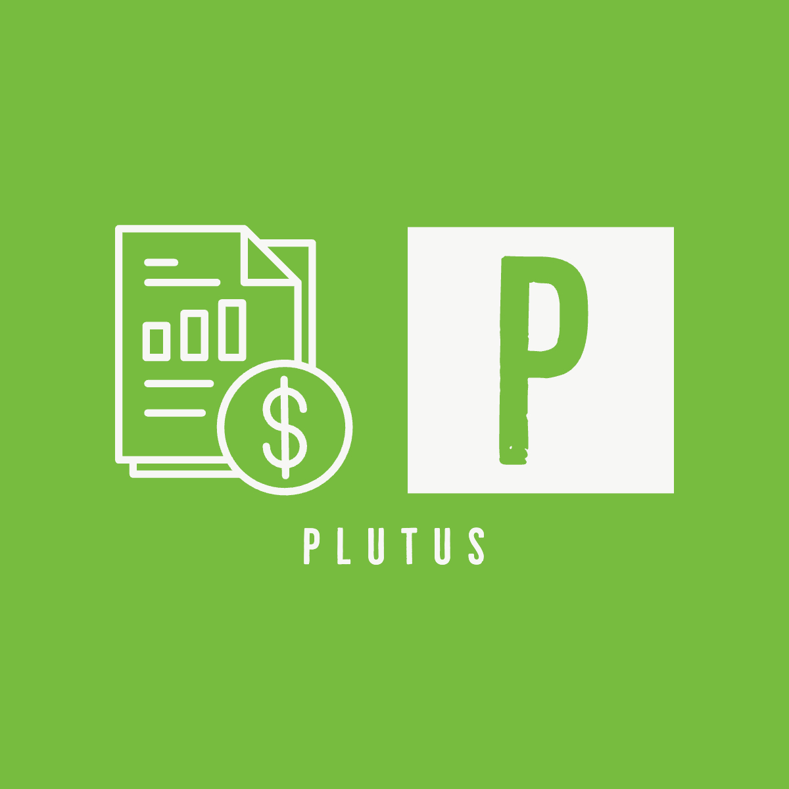

# Plutus

## Description

Plutus is an application that allows a registered user to get a clearer understanding of their personal finances. After the user inputs all of their income and expenses, Plutus will analyze the data and give a brief overview of the user's spending habits.

We made this application because we felt it was a project that could provide value to many people who have trouble identifying where their money is going. Plutus helps the user on knowing where to start with accomplishing their finance goals.

This was our groups first full stack application that we developed from scratch, thus we were able to utilize various technologies and concepts that helped further understanding such as: 

-Creating and populating databases with models 
-Using handlebars to render template pages on the front end 
-Utilizing tools on GitHub for project collaboration and management 

## Table of Contents

- [Installation](#installation)
- [Usage](#usage)
- [Features](#features)
- [Credits](#credits)
- [License](#license)
- [Badges](#badges)

## Installation

Click (here) to visit the Plutus application or scan the QR code below:  

*Insert heroku deployable link to Plutus* 

If you're a new user, click on "Sign Up".
Provide the required information, which will include your name, email address, and password.  

If you already have an account, click on "Login".
Enter your registered email address and password.

## Usage

Once logged in you will be presented with the Plutus dashboard - a quick breakdown of your income and expenses grouped by month. The navigation pane will allow you to access other sections of Plutus. These sections can be found in the Features part of the README

Do we need screenshots here or in the features section? 

## Features

<b>Budget:</b>

The Budget tab will allow you to plan out your expenses for a given month. Start by selecting a budget category from the dropdown list. Enter the corresponding cost of the category in the planned amount section and click Save.

Each selection you save will be added to a running total column on the right hand side and will allow you to quickly see your monthly expenses.

---

<b>Transactions:</b>

The transactions tab will allow you to calculate your remaining balance for a given month. Transactions are broken down into two categories:

-<b>Assets</b> are any form of monthly income that you would like to track, including but not limited to: paychecks from work, capital gains, alternative investments, etc. Click the Add more button to add an asset category and an amount. Each asset you save will be added to a running total column on the right hand side and will allow you to quickly see your total monthly income.

-<b>Liabilities</b> are any expenses you incur in a given month. Categories are provided in the dropdown for planned bills, though you will be able to add additional variable expenses here as well. Each liability will also be added to a running total column on the right hand side.

---

<b>Emergency Funds: </b>

Are we still using this section? </b>

---

<b>Trip Budget:</b>

The Trip Budget tab will allow the user to add expenses for an upcoming trip. Add a trip expense and give it a category. Enter the number of instances for this cost in the quantity field, then add the cost per unit in the unit cost field. The total value of this will be calculated and presented in the Amount column. Continue to add trip expenses as needed.

Once a trip expense has been added, a pie chart above will be generated. This chart will show a breakdown of all your trip expenses grouped together by category.

## Credits

SMU Coding Bootcamp

[Sucheta Mukherjee](https://github.com/sucheta90) 
[Brandon Forde](https://github.com/fordefam12) 
[Shawn Bunch](https://github.com/shbunch)

[Login form for Bulma framework](https://frontendshape.com/post/bulma-css-login-form-page-example) 

[Signup form for Bulma framework](https://frontendshape.com/post/bulma-css-registration-form-page-example) 

Any other credits here? 

## License

Do we need this 

## Badges

Do we need this 

